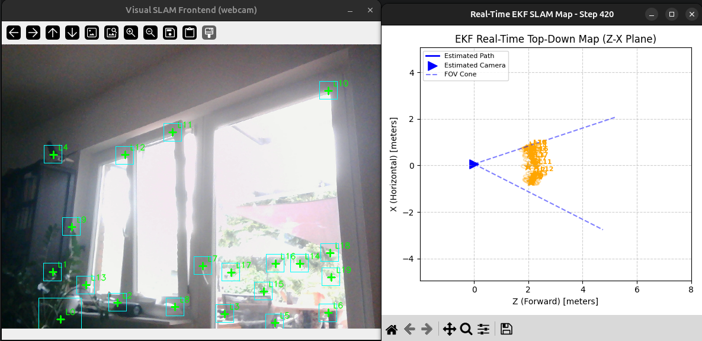

# Monocular 3D EKF SLAM

A real-time, state-of-the-art **Monocular 3D Extended Kalman Filter (EKF) SLAM** system. This repository implements visual simultaneous localization and mapping from scratch, using a single webcam or simulated synthetic data.

The backend estimates the full 13-DOF camera state (position, orientation quaternion, velocity, and angular rates) alongside 3D landmarks parameterized in an **Anchored Inverse Depth** representation. Mathematical optimization and Jacobians are pre-generated using **SymForce** for peak runtime performance.

---

## Visual Demonstration

Below is a visualization of the 3D EKF SLAM system tracking features and mapping estimated 3D landmark coordinates in a top-down Z-X plane:



---

## Core Features

- **Anchored Inverse Depth Parameterization**: Avoids the initialization singularity of infinite depth, enabling accurate representation of distant and newly initialized landmarks.
- **Active Feature Tracking**: Utilizes Normalized Cross-Correlation (NCC) template matching scoped strictly within the EKF's predicted $3\sigma$ innovation region to minimize computation and match mismatch.
- **Spatially-Uniform Feature Bucketing**: Enforces uniform corner distribution across the camera frame by dividing the search space into grid regions, avoiding tracking clustering and ensuring robust structural visibility.
- **Pre-computed Jacobians (SymForce)**: Real-time update rates are made possible by utilizing SymForce-generated symbolically optimized Jacobians for state transitions, initializations, and landmark measurements.
- **Camera Calibration Suite**: Includes an interactive calibration script using a standard chessboard pattern to output physical camera intrinsics (`camera_intrinsics.json`) and distortion coefficients.

---

## Repository Structure

```bash
.
├── README.md                  # This file
├── .gitignore                 # Standard Python git ignore rules
├── calibrate_camera.py        # Interactive chessboard camera calibration utility
├── camera_intrinsics.json     # Saved camera calibration intrinsics (matrix & distortion)
├── ekf.py                     # High-level mathematical updates of the EKF
├── main_synthetic.py          # EKF validation using a generated synthetic environment and path
├── main_webcam.py             # Main live-webcam Visual SLAM application with active tracking
├── sim_utils.py               # Plotting and synthetic camera projection tools
├── pic.png                    # Demo screenshot used in the README
└── gen_ekf/                   # SymForce symbolically optimized auto-generated files
    └── python/
        └── symforce/
            └── sym/
                ├── robot_state_update.py
                ├── robot_state_update_jacobian.py
                ├── landmark_measurement.py
                ├── landmark_measurement_jacobian.py
                ├── landmark_initialization.py
                └── landmark_initialization_jacobian.py
```

---

## Requirements

The project runs on standard Python environments. The main dependencies are:

- `numpy`
- `scipy`
- `opencv-python`
- `matplotlib`

You can install them via pip:
```bash
pip install numpy scipy opencv-python matplotlib
```

---

## Quick Start Guide

### 1. Camera Calibration
To run the EKF SLAM robustly on your live webcam, you must calibrate the lens distortion and focal length first:
1. Print out a standard chessboard pattern (default: 9x6 inner corners).
2. Run the calibration script:
   ```bash
   python calibrate_camera.py --cols 9 --rows 6 --square_size 23.0
   ```
3. Press `SPACE` or `C` to capture 15-20 distinct calibration images from different angles and distances.
4. Press `Q` or `ESC` to run the calibration. This will generate a copy-pasteable configuration for `main_webcam.py` and write details into `camera_intrinsics.json`.

### 2. Run Synthetic SLAM Simulation
To verify the EKF filter consistency, landmark initialization, and mathematical integrity without hardware constraints:
```bash
python main_synthetic.py
```
This runs a 3D camera trajectory on a pre-defined path amidst a point cloud of synthetic landmarks, plotting ground-truth vs. estimated trajectories.

### 3. Run Live Webcam SLAM
Once calibrated, plug in your webcam and launch the live monocular SLAM pipeline:
```bash
python main_webcam.py
```
- **Instructions**: Move your camera slowly side-to-side (building baseline/parallax) to allow the EKF to converge the landmarks' depth from the initial prior.
- **Controls**: Press `q` inside the OpenCV visualizer window to stop the tracking loop.
